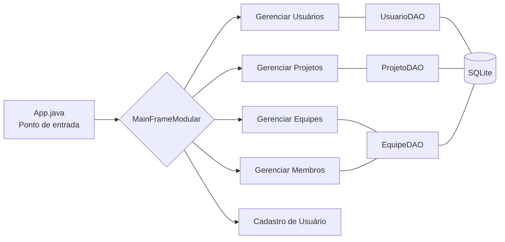

# 🚀 Sistema de Gestão de Projetos e Equipes

Sistema desktop profissional em **Java Swing** com arquitetura **MVC**, design empresarial e banco **SQLite**. Permite gestão completa de usuários, projetos e equipes com interface moderna, documentação detalhada e dados mockados para demonstração.

---

## 🎬 Apresentação
[▶️ Assista ao vídeo](etc/apresentacao.mp4)

## 🧭 Visão Geral do Sistema



---

## 📂 Arquitetura & Tecnologias

- **Java 8+**, **Swing**, **SQLite JDBC**, **Ikonli (FontAwesome)**, **JCalendar**, **Graphics2D**, **MVC + DAO + Observer**
- Estrutura de diretórios alinhada ao MVC; controllers isolam regras e chamam DAOs; views usam callbacks para navegação

```text
src/
├── controller/
├── dao/
├── model/
├── util/
└── view/
```

---

## 🧪 Seed de Dados Mockados

O utilitário `util.DataSeeder` limpa o banco `gestao_projetos.db` e insere dados fictícios:
- **Usuários:** Gestor, analistas, desenvolvedores
- **Equipes:** Phoenix, Atlas
- **Projetos:** Portal do Cliente, App Delivery, Dashboard Financeiro
- **Vínculos:** Membros distribuídos entre as equipes

Executar:
```bash
javac -cp "lib/*" -d bin src/util/DataSeeder.java
java -cp "bin;lib/*" util.DataSeeder
```

---

## ⚙️ Setup Rápido

```bash
git clone https://github.com/henriquerodrigues-dev/anhembi-morumbi-sistema-gestao-projetos-equipes.git
cd anhembi-morumbi-sistema-gestao-projetos-equipes
javac -cp "lib/*" -d bin src/App.java src/dao/*.java src/model/*.java src/util/*.java src/controller/*.java src/view/*.java
java -cp "bin;lib/*" App
```

> VS Code: abrir pasta, instalar *Extension Pack for Java*, executar `App.java`.

---

## 🎨 Design System Integrado

### Paleta
| Uso | Cor |
| --- | --- |
| Fundo principal | `#0B192C` |
| Sidebar | `#1E3E62` |
| Ações | `#FF6500` |
| Texto primário | `#ECF0F1` |
| Texto secundário | `#BDC3C7` |
| Sucesso | `#27AE60` |
| Aviso | `#F39C12` |
| Erro | `#E74C3C` |

### Tipografia
- `Segoe UI` (bold 28px títulos, 14px corpo, 12px auxiliares)
- Labels com ícones `FontAwesome Solid`

### Componentes
- Cards com sombras suaves (`rgba(0,0,0,20%)`)
- Botões com cantos 10px, gradientes suaves e estados hover/pressed
- Toasts em fila (máx. 5 visíveis) com barra de progresso automática de 3,5s
- Campos 35px altura com borda `#BDC3C7`

### Layout & Espaçamento
- Sidebar fixa 250px, conteúdo flexível
- Grid 1x2 para (formulário | lista)
- Espaçamentos: 10px (micro), 20px (blocos), 30px (margens principais)
- Cards/Formulários: padding 30px em container, `BoxLayout` vertical interno

### Acessibilidade
- Contraste alto, navegação por teclado, ícones + texto, feedback visual claro

---

## ✅ Funcionalidades Principais

- CRUD completo de usuários com validações (CPF, email, login, senha)
- Gestão de projetos com datas, status personalizável e seleção de gerente
- Equipes com modo edição + limpeza automática + lista atualizada
- Membros com busca inteligente, prevenção de duplicatas e atualização automática
- Sistema de toast com fila, timer visual, fechamento manual ou automático
- Seed automático de dados fictícios para demonstrações

---

## 📊 Métricas & Destaques

- ~3.500 linhas de código, 15+ classes, 100+ métodos
- Interface empresarial (gradientes, cards, ícones), UX consistente
- Performance otimizada: listas atualizam sem travar; operações atômicas
- Documentação integrada (README + design system + ajuda in-app)

---

## 🔮 Próximos Passos Sugeridos

- Modo escuro/claro e temas customizáveis
- Exportação de relatórios (PDF/CSV) e dashboards visuais
- Versão Spring Boot / JavaFX / REST API para expansão
- Notificações push e integrações externas

---

## 👁️‍🗨️ Informações Úteis

- **Projeto:** Sistema de Gestão de Projetos e Equipes
- **Disciplina:** Programação de Soluções Computacionais – Universidade Anhembi Morumbi
- **Tecnologias:** Java Swing + SQLite + MVC
- **Repositório:** [GitHub](https://github.com/henriquerodrigues-dev/anhembi-morumbi-sistema-gestao-projetos-equipes)

## 🙋‍♂️ Autor

Feito por **Henrique Rodrigues**

[](https://www.linkedin.com/in/henriquerodrigues-dev/)
[](https://github.com/henriquerodrigues-dev)
